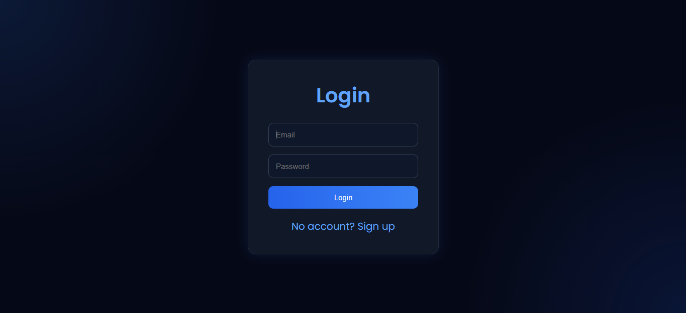
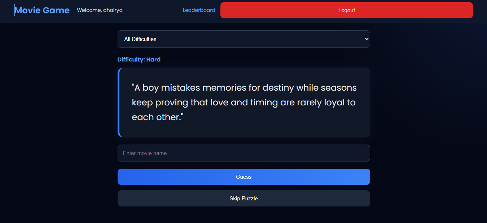
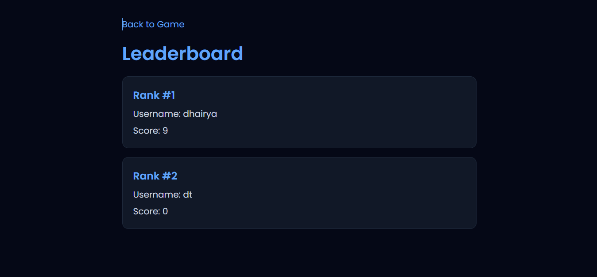

# Movie Game

# Features

## User Authentication

Users can:

- Sign Up
- Login
- Logout

Authentication is implemented using JWT tokens and backend routes.



---

## Random Puzzle Fetching

Users receive random movie puzzles fetched from MongoDB.

Each puzzle contains:

- Description
- Answer
- Difficulty
- Hint

---

## Difficulty Filtering

Users can filter puzzles based on difficulty levels:

- Easy
- Medium
- Hard

The selected difficulty is sent to the backend API to fetch matching puzzles.

---

## Hint System

Hints remain hidden initially.

The "Show Hint" button appears only after multiple wrong attempts.



---

## Puzzle Solving and Score Tracking

When a user solves a puzzle:

- The puzzle is added to the user's solved puzzles
- The user's score increases
- Duplicate puzzle solving is prevented

---

## Leaderboard

The leaderboard page displays users ranked by total puzzles solved.

Users are sorted in descending order of score.



# Backend APIs

## Authentication Routes

### Signup

```http
POST /api/auth/signup
```

### Login

```http
POST /api/auth/login
```

---

## Puzzle Routes

### Fetch Random Puzzle

```http
GET /api/puzzles/random
```

Optional difficulty filter:

```http
GET /api/puzzles/random?difficulty=Easy
```

### Solve Puzzle

```http
POST /api/puzzles/:id/solve
```

---

## User Routes

### Get User Progress

```http
GET /api/users/progress
```

### Get Leaderboard

```http
GET /api/users/leaderboard
```

# Running the Project

## Backend

```bash
cd backend
npm install
npm run dev
```

## Frontend

```bash
cd frontend
npm install
npm run dev
```
